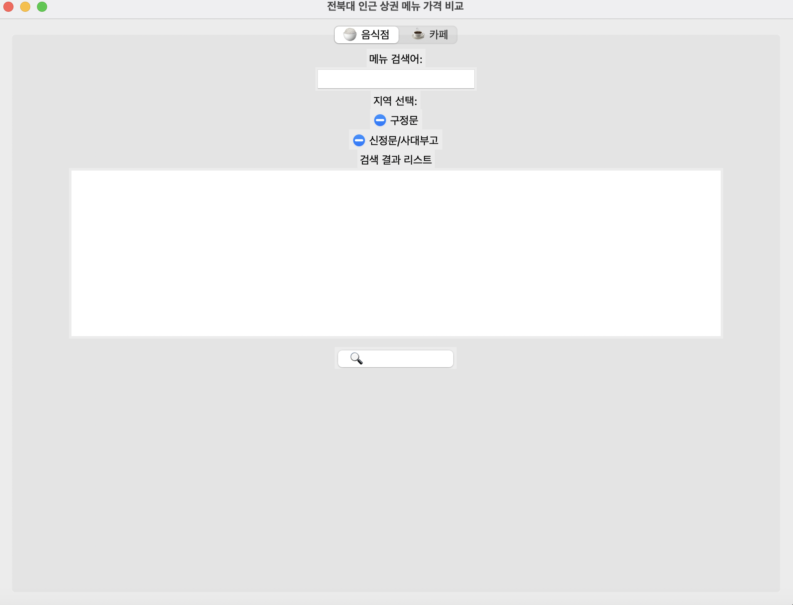
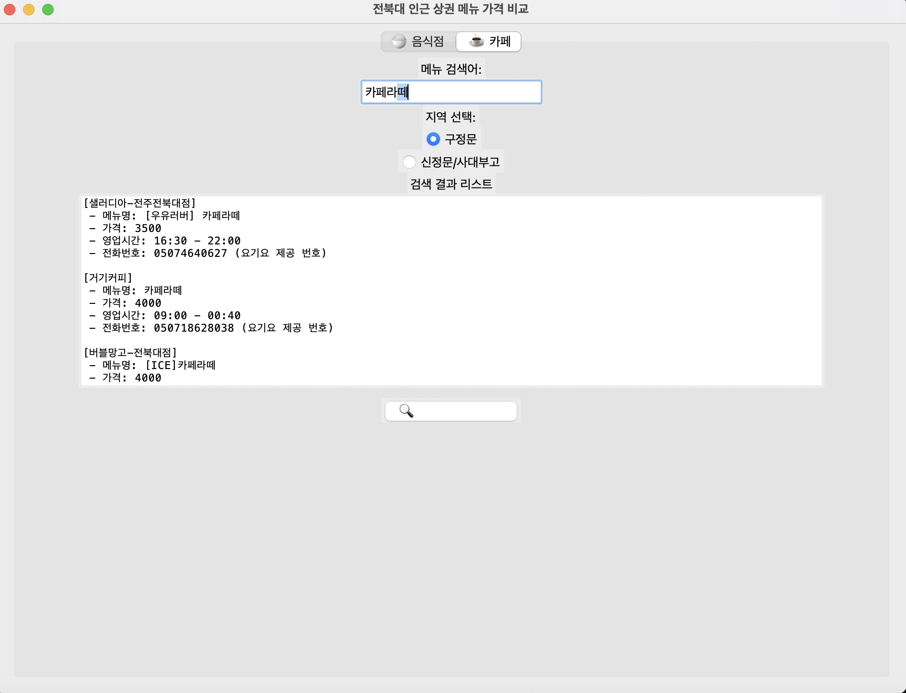
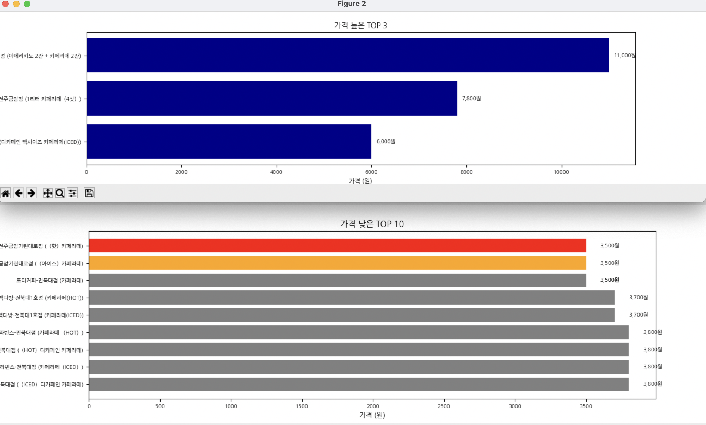
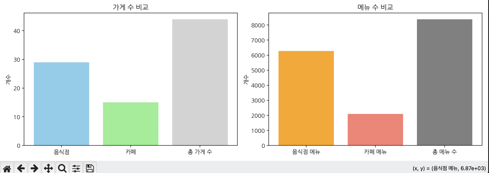
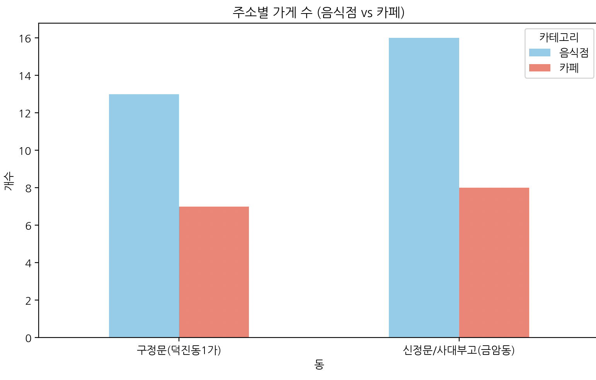

# Jeonbuk-Univ-Nearby-Price-Compare-Tool
프원실 기말 프로젝트 
> 전북대 인근(금암동/덕진동1가)의 음식점과 카페를 구분해 메뉴 가격 비교 서비스 제공
 

## 개발 기간
* '25. 05. 26.(수) ~ '25. 06. 18.(수)
 

## 개발 배경
전북대 주변 상권은 규모가 큰 편이라, 원하는 메뉴의 최저가를 한눈에 비교하기 어려웠다.

평소 메뉴 가격을 확인하려면 네이버나 배달 앱을 일일이 열어봐야 했고, 그 과정이 매우 번거롭게 느껴졌다.

이에 전북대 인근 지역(금암동, 덕진동1가)에 한정하여, 음식점과 카페의 메뉴 가격을 비교할 수 있는 툴을 직접 만들어보고자 했다.
 
 
## 주요 기능
### 데이터 수집 및 처리
- 요기요 모바일 웹페이지에서 `Selenium`으로 **음식점/카페 및 메뉴 정보 크롤링**
- **주소 기반 필터링**: 금암동(신정문/사대부고)과 덕진동1가(구정문) 상권으로 구분
- 수집된 데이터는 csv파일로 저장한 후, 가공하여 **SQLite 데이터베이스에 저장**

### 메뉴 가격 비교 기능
- **키워드 기반 검색**: 예) "아메리카노", "김치찌개" 입력 시, 모든 가게에서 해당 메뉴 가격 비교
- **최저가/최고가** 메뉴를 시각적으로 구분하여 한눈에 확인 가능 (그래프 상 색상 강조)
  
### 카테고리 필터링
- **업종 구분**: 음식점 / 카페 선택 가능
- **주소 구분**: 신정문/사대부고(금암동) / 구정문(덕진동1가) 선택 가능
- GUI에서 **카테고리 버튼 클릭 시 자동 필터링**

### 시각화 기능
- matplotlib을 사용하여 **GUI 외부 팝업 창에 그래프 표시**
- 검색된 메뉴 가격 데이터를 기준으로 **최저가/최고가 메뉴**를 시각화
- 가격 낮은 TOP 10 / 가격 높은 TOP 3를 각각 그래프로 구분

### GUI 시스템 (PySimpleGUI)
- **메인 화면 구성**: 지역 및 업종 선택 버튼, 통합 검색창
- **결과 출력**
  1. 검색된 메뉴 가격 정보를 `Text` 위젯에 레이블 형식으로 출력  
     (표시 항목: **가게명 / 메뉴명 / 가격 / 영업시간 / 전화번호**)
  2. 가격 낮은 TOP 10, 가격 높은 TOP 3 메뉴를 각각 **그래프로 시각화** (matplotlib 기반, 팝업창으로 출력)
## 결과물
### 메인 화면
> 지역 및 업종 선택, 메뉴 검색 입력창 등 GUI 기본 구성

### 메뉴 가격 비교 결과
> 특정 메뉴 키워드 입력 후 결과 출력 예시 (가게명, 가격 등 표시)

### 가격 비교 시각화
> 가격 높은 TOP 3, 가격 낮은 TOP 10 그래프

 

## 결과 분석 및 통계
### 총 수집 데이터 요약

- 음식점: **29곳**, 음식점 메뉴: **6,284개**
- 카페: **15곳**, 카페 메뉴: **2,101개**
- 총 가게 수: **44곳**, 총 메뉴 수: **8,385개**

### 가게 분포

- 구정문(덕진동1가): **20개**
- 신정문/사대부고(금암동): **24개**
 

## 기대 효과
- 같은 메뉴의 최저가 탐색 기능을 통해 **실질적인 식비 절약** 이 가능함
- 시험기간 등 **바쁜 상황**에서 빠르게 식사 결정을 내릴 수 있어 시간 절약
- **향후 지도 연동, 인기 메뉴 시각화, 추천 알고리즘** 등을 추가하면 서비스 확장성도 매우 높음

## 아쉬운 점 및 기술적 한계
- 요기요 모바일 웹페이지가 동적 페이지 기반이라, 페이지 새로고침 시마다 가게 목록 순서가 변경됨  
→ 이로 인해 StaleElementException, 클릭 실패, 진입 누락 등 일부 가게 수집에 어려움이 발생함
- 공식 API가 제공되지 않아, 원하는 정보를 일일이 크롤링해야 하는 한계 존재
 

## 개발 환경

### 프로그래밍 언어
- Python 3.11.0
  
### 웹 크롤링 도구
- Selenium

### 데이터베이스
- SQLite

### GuI 라이브러리
- PySimpleGUI
- Tkinter (표준 라이브러리)

### 사용 라이브러리

#### 외부 라이브러리
- `selenium`
- `pandas`
- `matplotlib`
- `koreanize-matplotlib`
  
#### 표준 라이브러리
- `sqlite3`
- `glob`
- `time`

